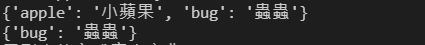

# Python 集合、字典的基本運算 - Set、Dictionary
## 集合
一群資料、沒有順序性  
```
# 集合的運算
s1 = {3, 4, 5}
s2 = {4, 5, 6 ,7}

print("s1: ", s1)
print("s2: ", s2)
```

###  判斷資料是否存在
使用 `in` 和 `not in` 運算符號  
```
print("3 in s1: ", 3 in s1) #判斷"3"有沒有在s1集合中，若有則回傳true
print("10 in s1: ", 10 in s1)
print("10 not in s1: ", 10 not in s1) #判斷"10"沒有在s1集合中，回傳true
```


### 交集、聯集  
使用`&`和`|`運算符號
```
s3 = s1&s2 #交集: 取兩個集合中相同的資料
print("s1&s2:", s3, " #交集: 取兩個集合中相同的資料")

s3 = s1|s2 #聯集: 取兩集合中的所有資料，但不重複放
print("s1|s2:", s3, " #聯集: 取兩集合中的所有資料，但不重複放")
```


### 差集、反交集
使用`-`和`^`運算符號  
```
s3 = s1-s2 #差集: 從s1中減去與s2中重疊的部分
print("s1-s2:", s3, " #差集: 從s1中減去與s2中重疊的部分")

s3 = s1^s2 #反交集: 取兩個集合中不重疊的部分
print("s1^s2:", s3, " #反交集: 取兩個集合中不重疊的部分")
```


### 字串拆解為集合
set(字串)  
```
## set(字串)
s = set("Hello") #自動將字串中的文字拆解成"集合"
print("\nset s:", s)
print("Test if \"H\" is in the string:", "H" in s)
```


## 字典
鍵值對(Key-Value Pair) - 一個key對應一個Value  
### Key對應Value
字典[key]  
字典[key] = Value
```
#字典的運算
dic={"apple":"蘋果", "bug":"蟲蟲"}
print("\n", dic)
print(dic["apple"]) #回傳"apple"的value值
dic["apple"]="小蘋果"
```


### 判斷資料是否存在
使用`in`和`not in`運算符號
`print("判斷\"apple\"這個key是否存在", "apple" in dic)`  

### 刪除鍵值對
使用`del`運算關鍵字
```
#刪除
print(dic)
del dic["apple"] #刪除字典中的鍵值對 (key-value pair)
print(dic)
```


### 從列表建立字典
以列表的資料為基礎來建立字典  
```
#用列表的方式產生字典
dic= {x: x*2 for x in [3, 4, 5]}
print("用列表的方式產生字典", dic)
```
